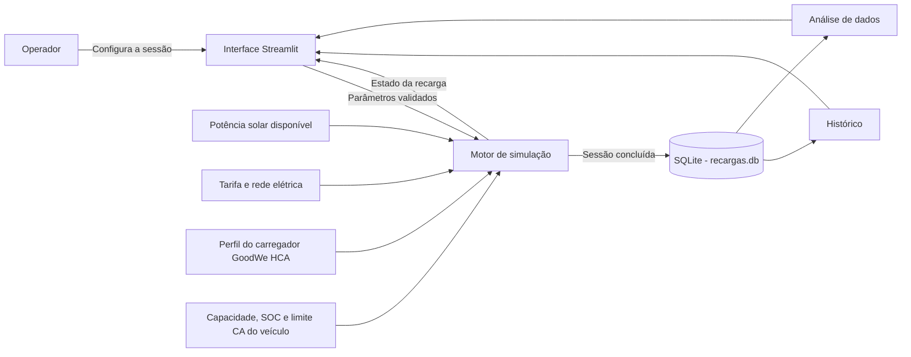
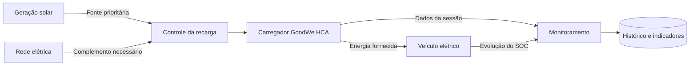

# ChargeGrid Intelligence

## Sprint 3 - Prototipagem Funcional e Integração Interdisciplinar

Projeto interdisciplinar desenvolvido para as disciplinas de **Pensamento Computacional com Python** e **Soluções de Energias Renováveis e Sustentáveis**, no contexto do **GoodWe Challenge**. O mesmo protótipo integra os conteúdos das duas matérias ao relacionar desenvolvimento de software, automação, energia solar, mobilidade elétrica, eficiência energética e análise de dados.

O **ChargeGrid Intelligence** é um protótipo funcional que simula uma estação de recarga de veículos elétricos equipada com carregadores GoodWe HCA. A aplicação calcula o fluxo energético da sessão, combina geração solar e rede elétrica, acompanha a evolução da bateria, estima perdas e custos e armazena os resultados para consulta e análise.

> O projeto é uma simulação acadêmica. Não existe comunicação direta com carregadores, inversores ou medidores físicos nesta versão.

## Equipe

| Integrante | RM |
| --- | ---: |
| Lucas Lino Marques da Silva | 572863 |
| Bruno Riquelme Coutinho Pereira | 569619 |
| Eduardo Bigoli Portela | 569897 |
| Gabriel Martins Cordeiro Rodrigues | 570497 |
| Gustavo Fondato de Souza | 573651 |
| Gustavo Martins da Silva | 570584 |

## Objetivo da solução

O projeto demonstra como uma estação de recarga pode utilizar prioritariamente a energia solar disponível e recorrer à rede elétrica somente para complementar a potência exigida pelo veículo. O protótipo permite configurar diferentes condições de operação e visualizar, durante a sessão, como os componentes atuam em conjunto.

A solução foi construída para:

- simular carregadores GoodWe HCA de diferentes potências;
- respeitar o limite de recarga em corrente alternada aceito pelo veículo;
- calcular a energia necessária para elevar o estado de carga da bateria;
- dividir o fornecimento entre energia solar e rede elétrica;
- estimar duração, perdas e custo da recarga;
- automatizar o avanço e a conclusão da sessão;
- registrar as sessões em banco de dados;
- transformar os registros em indicadores e gráficos.

## Arquitetura e integração dos componentes



### Fluxo energético simulado



### Fluxo de uma sessão

1. O operador seleciona o carregador e informa os dados do veículo e da instalação.
2. O sistema valida os parâmetros e apresenta uma previsão da recarga.
3. Ao iniciar a operação, a simulação avança automaticamente em intervalos de cinco minutos.
4. A interface atualiza o SOC, o tempo restante, as fontes de energia, as perdas e o custo.
5. A sessão termina quando a carga desejada é atingida ou quando o operador solicita a finalização.
6. Os resultados são gravados no SQLite e ficam disponíveis nas telas de histórico e análise.

## Componentes do protótipo

### Interface e automação

O arquivo `app.py` implementa a interface em Streamlit e controla os três estados da operação: configuração, monitoramento e conclusão. Durante a recarga, o estado é recalculado automaticamente, os gráficos são atualizados e a sessão é encerrada ao atingir o SOC desejado.

A aplicação possui três áreas principais:

- **Simulação:** configuração, previsão, execução e resumo da recarga;
- **Histórico:** consulta das sessões concluídas e indicadores acumulados;
- **Análise dos Dados:** gráficos de evolução, matriz energética e eficiência renovável.

### Motor de simulação

O arquivo `simulator.py` concentra as regras de negócio. Ele valida as entradas e calcula potência efetiva, energia necessária, duração, participação solar, consumo da rede, perdas, custo e evolução do SOC.

Modelos representados no protótipo:

| Modelo | Potência nominal | Tensão | Corrente | Instalação |
| --- | ---: | ---: | ---: | --- |
| GW7K-HCA | 7 kW | 230 V | 32 A | Monofásica |
| GW11K-HCA | 11 kW | 400 V | 16 A | Trifásica |
| GW22K-HCA | 22 kW | 400 V | 32 A | Trifásica |

### Persistência e análise

O arquivo `database.py` gerencia o banco SQLite. Cada sessão salva contém data e hora, modelo do carregador, potência, duração, capacidade da bateria, SOC inicial e final, energia total, energia armazenada, energia solar, energia da rede, perdas, participação renovável e custo estimado.

O banco também fornece os dados para os indicadores consolidados:

- quantidade total de sessões;
- energia total fornecida;
- energia solar acumulada;
- energia consumida da rede;
- consumo médio por sessão;
- participação solar ponderada no conjunto das recargas.

## Lógica de funcionamento

A potência efetiva é limitada pelo menor valor entre a estação e o carregador interno do veículo:

```text
potência efetiva = mínimo(potência do HCA, limite CA do veículo)
```

A fonte solar é utilizada até o limite da potência exigida. A rede fornece apenas o complemento:

```text
potência solar utilizada = mínimo(potência solar disponível, potência efetiva)
potência da rede = potência efetiva - potência solar utilizada
```

A energia que deve chegar à bateria depende da capacidade e da diferença entre o SOC inicial e o SOC desejado:

```text
energia da bateria = capacidade da bateria x (SOC desejado - SOC inicial) / 100
```

Como a recarga apresenta perdas, a energia solicitada à estação é maior:

```text
energia da estação = energia da bateria / eficiência
duração = energia da estação / potência efetiva
custo = energia consumida da rede x tarifa
```

## Justificativa técnica das escolhas

### Python

Python foi escolhido por permitir separar claramente interface, regras de negócio e persistência. A linguagem também facilita cálculos, validações, manipulação de dados e evolução futura do protótipo.

### Streamlit

O Streamlit permite transformar os cálculos em uma aplicação web interativa com baixo custo de implementação. Seus componentes atendem à configuração da sessão, atualização de métricas e apresentação de tabelas e gráficos.

### SQLite

O SQLite oferece persistência local sem exigir a instalação ou administração de um servidor de banco de dados. Para a escala acadêmica do protótipo, ele mantém a solução simples, reproduzível e suficiente para histórico e análise.

### Pandas

O Pandas organiza os registros do banco em uma estrutura tabular compatível com as visualizações do Streamlit, facilitando comparações cronológicas e análises das fontes de energia.

### Carregadores GoodWe HCA

Os perfis de 7 kW, 11 kW e 22 kW permitem representar instalações monofásicas e trifásicas e comparar diferentes capacidades de recarga. A lógica também considera que a potência real pode ser limitada pelo veículo, evitando assumir que a potência nominal da estação será sempre utilizada integralmente.

## Resultados e dados funcionais

Para demonstrar o funcionamento de forma reproduzível, pode-se utilizar o cenário padrão da aplicação:

| Parâmetro | Valor |
| --- | ---: |
| Carregador | GW11K-HCA |
| Capacidade útil da bateria | 60 kWh |
| SOC inicial | 20% |
| SOC desejado | 80% |
| Limite CA do veículo | 11 kW |
| Potência solar disponível | 5 kW |
| Eficiência estimada | 90% |
| Tarifa da rede | R$ 1,00/kWh |

Resultados calculados para esse cenário:

| Indicador | Resultado aproximado |
| --- | ---: |
| Energia armazenada na bateria | 36,00 kWh |
| Energia fornecida pela estação | 40,00 kWh |
| Perdas estimadas | 4,00 kWh |
| Potência efetiva | 11,00 kW |
| Duração estimada | 3 h 39 min |
| Energia solar | 18,18 kWh |
| Energia da rede | 21,82 kWh |
| Participação solar | 45,45% |
| Custo estimado da rede | R$ 21,82 |

O cenário evidencia a integração proposta: a geração solar atende parte da demanda, a rede complementa a potência e o sistema acompanha automaticamente o impacto de cada fonte na duração, no custo e na sustentabilidade da sessão.

## Sustentabilidade, automação e eficiência energética

- **Sustentabilidade:** o sistema mede a participação renovável e evidencia a quantidade de energia da rede evitada pelo uso da fonte solar.
- **Automação inteligente:** a aplicação valida limites, calcula o plano de recarga, atualiza o estado e encerra a sessão automaticamente.
- **Eficiência energética:** as perdas são consideradas separadamente da energia armazenada na bateria.
- **Gestão de custos:** somente a parcela proveniente da rede é usada no cálculo do custo estimado.
- **Apoio à decisão:** histórico e gráficos permitem comparar sessões e identificar cenários com maior aproveitamento solar.

## Conexão com as disciplinas

O ChargeGrid Intelligence foi desenvolvido como uma única solução interdisciplinar. Cada disciplina analisa uma dimensão complementar do projeto: **Pensamento Computacional com Python** sustenta a implementação e a automação, enquanto **Soluções de Energias Renováveis e Sustentáveis** fundamenta o fluxo energético e a avaliação de eficiência e sustentabilidade.

### Pensamento Computacional com Python

O protótipo aplica os seguintes conteúdos:

- decomposição do problema em módulos de interface, simulação e banco de dados;
- funções para encapsular cálculos e responsabilidades;
- estruturas condicionais para validação e controle dos estados da sessão;
- dicionários, listas e tabelas para representar equipamentos e medições;
- tratamento de entradas inválidas com exceções;
- persistência e consultas com SQL;
- automação de um processo por meio de regras e transições de estado;
- análise e visualização de dados com Pandas e Streamlit;
- abstração de um sistema físico por meio de um modelo computacional.

### Soluções de Energias Renováveis e Sustentáveis

O protótipo aplica os seguintes conteúdos:

- uso da geração fotovoltaica como fonte prioritária para a recarga;
- complementação da demanda pela rede elétrica quando a potência solar é insuficiente;
- balanço energético entre energia fornecida, energia armazenada e perdas;
- comparação da participação renovável entre diferentes sessões;
- avaliação do impacto da eficiência no consumo total da estação;
- acompanhamento da dependência da rede e do custo associado à energia não renovável;
- aplicação de energia limpa à mobilidade elétrica;
- uso de indicadores para apoiar decisões voltadas à eficiência energética.

### Integração interdisciplinar

A integração acontece quando os conceitos energéticos são transformados em regras computacionais executáveis. O motor em Python calcula o balanço de energia, a interface automatiza e apresenta a operação, e o banco de dados preserva os resultados para análise. Dessa forma, o software não apenas exibe informações: ele representa o comportamento de uma solução energética integrada e permite comparar cenários de uso da fonte solar.

## Limitações do protótipo

Para manter o escopo adequado à Sprint 3, o modelo adota algumas simplificações:

- a potência solar permanece constante durante cada sessão;
- a recarga utiliza potência constante, sem curva de redução próxima ao SOC máximo;
- a eficiência é informada como um percentual fixo;
- não são considerados temperatura, degradação da bateria ou variação da tarifa no tempo;
- não há comunicação real com carregador, inversor, medidor ou protocolo OCPP;
- os dados apresentados são simulados e não substituem medições de uma instalação real.

Essas limitações não impedem a demonstração da integração lógica. Como evolução futura, o sistema pode receber telemetria de equipamentos reais e aplicar estratégias dinâmicas de controle.

## Estrutura do projeto

```text
sprint3-pcp-sers/
|-- app.py              # Interface, navegação e automação da sessão
|-- simulator.py        # Regras e cálculos da recarga
|-- database.py         # Persistência e consultas SQLite
|-- requirements.txt    # Dependências do projeto
|-- assets/
|   `-- goodwe-logo.png # Identidade visual utilizada na interface
`-- README.md            # Relatório técnico e instruções
```

O arquivo `recargas.db` é criado automaticamente na primeira execução. Pastas locais como `.venv`, `.idea` e `__pycache__` não fazem parte da entrega no GitHub.

## Como executar

### Pré-requisitos

- Python 3.10 ou superior;
- `pip` disponível no terminal.

### Instalação

Clone o repositório:

```bash
git clone https://github.com/lucaslino28/fiap-ciencia-da-computacao.git
```

Depois, acesse a pasta correspondente à disciplina.

Para **Pensamento Computacional com Python**:

```bash
cd fiap-ciencia-da-computacao/2026/pensamento-computacional-python/2-semestre/atividades/sprint3-pcp-sers
```

Para **Soluções de Energias Renováveis e Sustentáveis**:

```bash
cd fiap-ciencia-da-computacao/2026/solucoes-energias-renovaveis-sustentaveis/2-semestre/atividades/sprint3-pcp-sers
```

Crie e ative um ambiente virtual.

No Windows:

```powershell
python -m venv .venv
.\.venv\Scripts\Activate.ps1
```

No Linux ou macOS:

```bash
python3 -m venv .venv
source .venv/bin/activate
```

Instale as dependências:

```bash
python -m pip install -r requirements.txt
```

Inicie a aplicação:

```bash
python -m streamlit run app.py
```

O Streamlit exibirá no terminal o endereço local para acesso pelo navegador, normalmente `http://localhost:8501`.

## Demonstração técnica

O vídeo da Sprint 3 apresenta a configuração de uma sessão, a integração entre geração solar, rede, carregador e veículo, o monitoramento automatizado e a consulta dos dados persistidos nas telas de histórico e análise.

O link não listado do YouTube deve ser informado no arquivo `.txt` oficial de entrega, junto dos nomes, RMs e link do repositório, conforme solicitado no enunciado.

## Possíveis evoluções

- integração com telemetria real de inversores, medidores e carregadores;
- comunicação por OCPP;
- leitura de geração fotovoltaica variável ao longo do tempo;
- tarifação por horário e estratégias de recarga fora de ponta;
- autenticação de usuários e identificação de veículos;
- exportação de relatórios e indicadores ambientais;
- otimização simultânea de múltiplos pontos de recarga.
